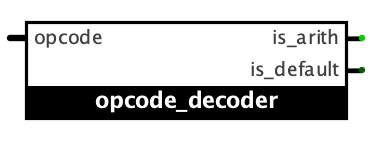
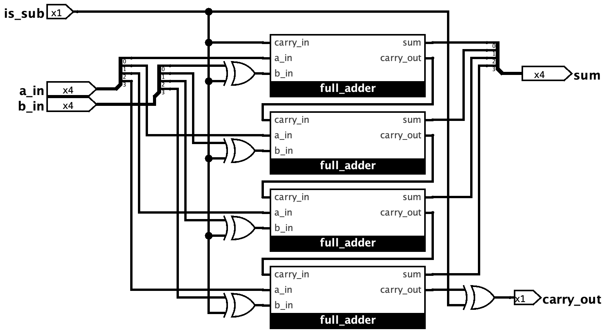
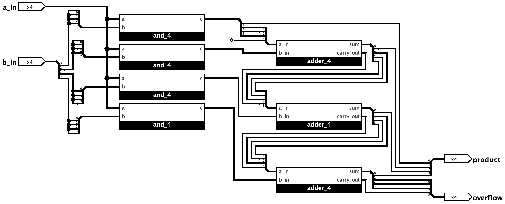
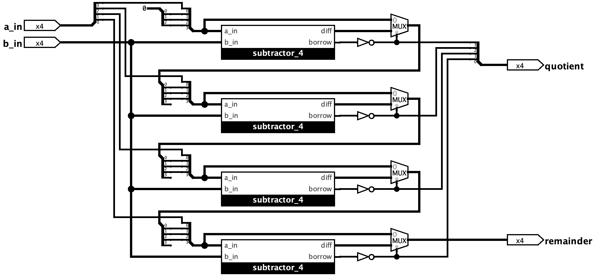
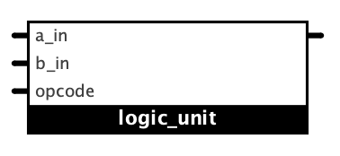
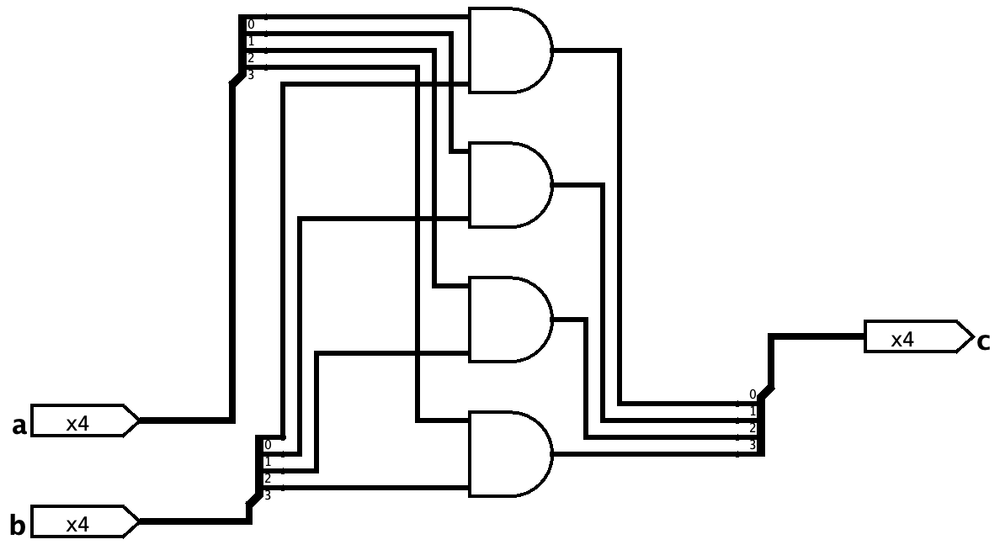
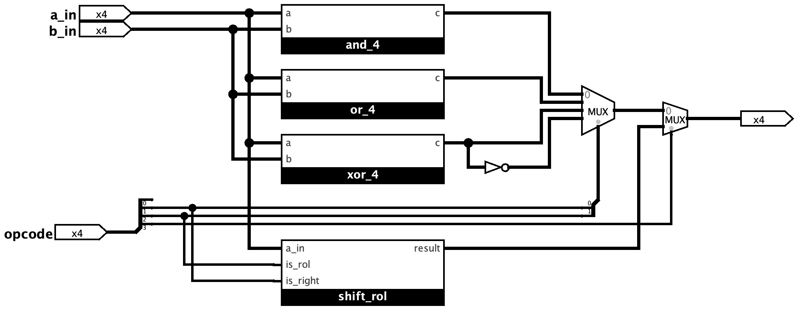
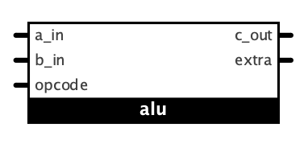
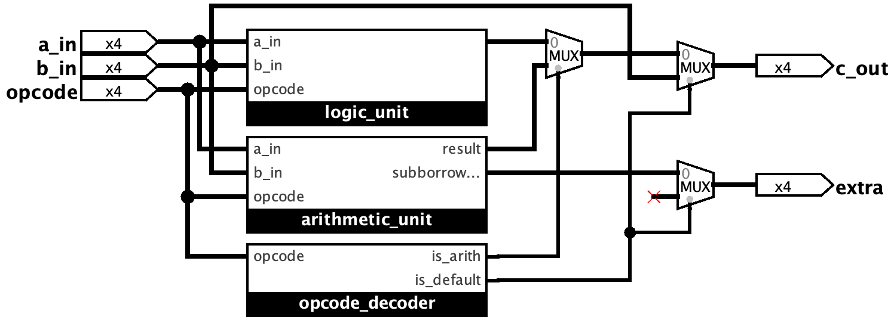

#### [<< Quay trở lại SPEC](./README.md)

# 2. ALU

## 2.1. Phân tích và thiết kế

Bảng chân lý:

|i_op[3:0]|operation|i_op[3:0]|operation|
|:-:|:-:|:-:|:-:|
|0000|SUB|1000|__DIV__|
|0001|AND|1001|__SHL__|
|0010|ADD|1010|__MUL__|
|0011|OR |1011|__SHR__|
|0100|XOR|1100|__ROL__|
|0110|__XNOR__|1110|__ROR__|
|||||
|Others|MOV|||

*Các phép toán được __in đậm__ là những phép được mở rộng thêm so với đề bài gốc.

Bảng kmap

|_opcode_|_op3 op2_||||
|:-:|:-:|:-:|:-:|:-:|
|___op1 op0___|00|01|11|10|
|00|SUB|XOR|__ROL__|__DIV__|
|01|AND|MOV|MOV|__SHL__|
|11|OR|MOV|MOV|__SHR__|
|10|ADD|__XNOR__|__ROR__|__MUL__|

Các phép toán số học:
- __ADD__: cộng
- __SUB__: trừ
- __MUL__: nhân
- __DIV__: chia

Các phép toán logic:
- __AND__
- __OR__
- __XOR__
- __XNOR__
- __SHL__: dịch trái
- __SHR__: dịch phải
- __ROL__: dịch vòng trái
- __ROR__: dịch vòng phải

Không thực hiện tính toán:
- __MOV__

### 2.1.1. Module giải mã mã lệnh opcode_decoder

Module này giúp xác định với opcode hiện tại thì đầu ra sẽ cần được lấy từ module nào, bộ tính toán số học hay logic, nếu là trường hợp mặc định thì sẽ lấy đầu ra tương ứng với một trong những đầu vào (cụ thể là đầu vào i_b).

Đầu vào:
- __opcode__ (4 bit): mã lệnh cần thực hiện.

Đầu ra:
- __is_arith__ (1 bit): is_arith = 1 thực hiện phép toán số học, is_arith = 0 thực hiện phép toán logic.
- __is_default__ (1 bit): is_default = 1 chỉ đưa đầu vào (i_b) xuất ra ngoài thành kết quả, is_default = 0 thực hiện phép toán số học hoặc logic tuỳ vào trạng thái của is_arith.

#### 2.1.1.1. Trường hợp mặc định

Phép __MOV__ là phép mặc định khi ALU __không__ thực hiện các phép tính toán số học và logic.

|_opcode_|_op3 op2_||||
|:-:|:-:|:-:|:-:|:-:|
|___op1 op0___|00|___01___|___11___|10|
|00|SUB|XOR|ROL|DIV|
|___01___|AND|___MOV___|___MOV___|SHL|
|___11___|OR|___MOV___|___MOV___|SHR|
|10|ADD|XNOR|ROR|MUL|

Từ bảng trên, dễ dàng suy ra với opcode __op3 op2 op1 op0__ thì tổ hợp để xác định các trường hợp mặc định là:

__is_default = op2 AND op0__

#### 2.1.1.2. Phép toán số học

Phép toán số học là những phép __ADD, SUB, MUL, DIV__.

|_opcode_|_op3 op2_||||
|:-:|:-:|:-:|:-:|:-:|
|___op1 op0___|___00___|01|11|___10___|
|___00___|___SUB___|XOR|ROL|___DIV___|
|01|AND|MOV|MOV|SHL|
|11|OR|MOV|MOV|SHR|
|___10___|___ADD___|XNOR|ROR|___MUL___|

Từ bảng trên, dễ dàng suy ra với opcode __op3 op2 op1 op0__ thì tổ hợp để xác định các trường hợp tính toán số học là:

__is_arith = op2 NOR op0__

#### 2.1.1.3. Phép toán logic

Phép toán logic là những phép __AND, OR, XOR, XNOR, ROL, ROR, SHL, SHR__.

|_opcode_|_op3 op2_||||
|:-:|:-:|:-:|:-:|:-:|
|___op1 op0___|00|01|11|10|
|00|SUB|___XOR___|___ROL___|DIV|
|01|___AND___|MOV|MOV|___SHL___|
|11|___OR___|MOV|MOV|___SHR___|
|10|ADD|___XNOR___|___ROR___|MUL|

Có thể thấy nếu không rơi vào trường hợp mặc định hay các phép toán số học thì sẽ là trường hợp còn lại, phép toán logic.

#### 2.1.1.4. opcode_decoder

Với những phân tích như ở trên thì có thể xây dựng module xác định opcode hiện tại đang là phép tính logic, số học hay mặc định như sau:

___opcode_decoder___

### 2.1.2. Module tính toán số học arithmetic_unit

Module này thực hiện phép toán số học với các đầu vào.

Đặc điểm: Hỗ trợ các phép ADD (cộng), SUB (trừ) các số nguyên có dấu, MUL (nhân), DIV (chia) các số nguyên không dấu.

Đầu vào:
- __a_in__ (4 bit), __b_in__ (4 bit): các toán hạng khi thực hiện phép toán số học. Tuỳ vào phép toán cần thực hiện là cộng/trừ hay nhân/chia mà 4 bit này sẽ biểu diễn cho giá trị số nguyên có dấu hay không dấu.
- __opcode__ (4 bit): mã lệnh truyền vào, khi giải mã sẽ xác định được phép toán cần thực hiện và đưa ra đầu ra kết quả tương ứng.

Đầu ra:
- __result__ (4 bit): kết quả sau khi thực hiện phép toán.
- __subborrow_addcarry_divremainder_muloverflow__ (1 hoặc 4 bit): tuỳ vào phép toán mà sẽ có thêm những giá trị được tính toán kèm theo, được biểu diễn bằng 1 hoặc 4 bit:
  - SUB: borrow (1 bit)
  - ADD: carry (1 bit)
  - DIV: remainder (4 bit)
  - MUL: overflow (4 bit)

#### 2.1.2.1. Bộ cộng/trừ 4 bit

#### 2.1.2.2. Bộ nhân 4 bit

#### 2.1.2.3. Bộ chia 4 bit

#### 2.1.2.4. arithmetic_unit

### 2.1.3. Module tính toán logic logic_unit

#### 2.1.3.1. Bộ and 4 bit

#### 2.1.3.2. Bộ or 4 bit

#### 2.1.3.3. Bộ xor 4 bit

#### 2.1.3.4. logic_unit

### 2.1.4. Module tính toán alu

## 2.2. Thử nghiệm thiết kế

### 2.2.1. Thử nghiệm các phép toán số học

#### 2.2.1.1. Phép cộng (ADD)

##### 2.2.1.1.1. Cộng 2 số dương

###### a) Tính toán hợp lệ:

0011 (3) + 0001 (1) = 0100 (4)

###### b) Bị tràn số:

0110 (6) + 0101 (5) = ~~1011 (-5)~~

##### 2.2.1.1.2. Cộng 2 số âm

###### a) Tính toán hợp lệ

1110 (-2) + 1100 (-4) = 1010 (-6)

###### b) Bị tràn số

1010 (-6) + 1011 (-5) = ~~0101 (5)~~

##### 2.2.1.1.3. Cộng số âm dương

1010 (-6) + 0100 (4) = 1110 (-2)

#### 2.2.1.2. Phép trừ (SUB)

##### 2.2.1.2.1. Trừ 2 số dương

0110 (6) - 0011 (3) = 0011 (3)

0100 (4) - 0111 (7) = 1101 (-3)

##### 2.2.1.2.2. Trừ 2 số âm

1000 (-8) - 1111 (-1) = 1001 (-7)

1111 (-1) - 1010 (-6) = 0101 (5)

##### 2.2.1.2.3. Trừ số âm cho số dương

###### a) Tính toán hợp lệ

1111 (-1) - 0011 (3) = 1100 (-4)

###### b) Bị tràn số

1000 (-8) - 0100 (4) = ~~0100 (4)~~

##### 2.2.1.2.4. Trừ số dương cho số âm

###### a) Tính toán hợp lệ

0011 (3) - 1110 (-2) = 0101 (5)

###### b) Bị tràn số

0111 (7) - 1011 (-5) = ~~1100 (-4)~~

#### 2.2.1.3. Phép nhân (MUL)

Tích ({extra, result}):
1011 (11) * 0011 (3) = 0010 0001 (33)

#### 2.2.1.4. Phép chia (DIV)

Thương (result):
1011 (11) / 0011 (3) = 0011 (3)

Dư (extra):
1011 (11) % 0011 (3) = 0010 (2)

### 2.2.2. Thử nghiệm các phép toán logic

#### 2.2.2.1. AND

1011 AND 0011 = 0011

#### 2.2.2.2. OR

1011 OR 0011 = 1011

#### 2.2.2.3. XOR

1011 XOR 0011 = 1000

#### 2.2.2.4. XNOR

1011 XNOR 0011 = 0111

#### 2.2.2.4. ROL

ROL 1011 = 0111

#### 2.2.2.5. ROR

ROR 1011 = 0111

#### 2.2.2.6. SHL

SHL 1011 = 0110

#### 2.2.2.7. SHR

SHR 1011 = 0101

### 2.2.3. Trường hợp opcode mặc định, thực hiện phép MOV c_out, b_in

c_out = b_in = 1100

#### [<< Quay trở lại SPEC](./README.md)