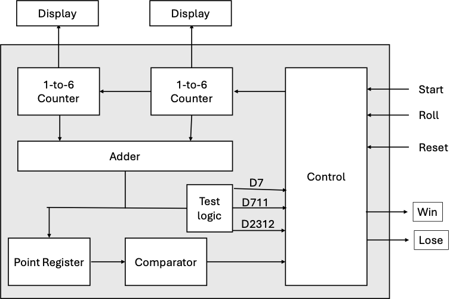
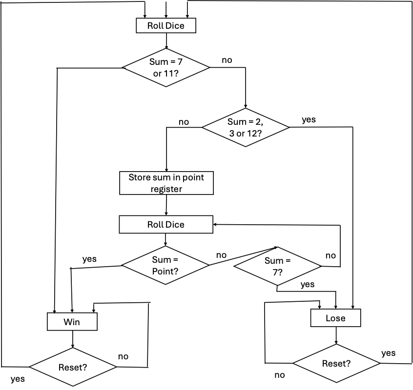

# 1. SPEC
# 1.1. Thiết kế bộ ALU đơn giản
``` verilog
case(i_op[3:0]) 
 4'b0000:{c,o_c } <= {1'b0,i_a}-{1'b0,i_b}; // SUB 
 4'b0001:   o_c   <= i_a & i_b;             // And 
 4'b0010:{c,o_c } <= i_a + i_b;             // Add 
 4'b0011:   o_c   <= i_a | i_b;             // Or 
 4'b0100:   o_c   <= i_a ^ i_b;             // Xor 
                                            // .... 
 default:   o_c   <= i_b;                   // MOV
```

### Bài làm:

#### [>> File Logisim](./Logisim/alu.circ)

### Phân tích thiết kế và thử nghiệm:

#### [>> ALU report](./ALU.md)

# 1.2. Xúc xắc điện tử

Mô tả: Sơ đồ khối của xúc xắc điện tử được cho ở Hình 1. Hai counter được sử dụng để mô phỏng việc tung 2 xúc xắc. Mỗi counter đếm chuỗi sau 1,2,3,4,5,6,1,2, ... Theo đó, sau khi tung 2 xúc xắc, tổng của các giá trị trong 2 counter sẽ có giá trị từ 2 đến 12. Luật chơi như sau: 
1. Sau lần tung đầu tiên, người chơi thắng nếu tổng là 7 hoặc 11. Người chơi thua nếu tổng là 2, 3 hoặc 12. Ngược lại, giá trị tổng mà người chơi ghi được sẽ được gọi là point, người chơi phải tung lại.  
2. Từ lần tung thứ 2 trở đi, người chơi thắng nếu tổng bằng point, thua nếu tổng bằng 7. Ngược lại, người chơi phải tung lại cho đến khi đạt kết quả thắng hoặc thua. Tổng mới trở thành new point nếu người chơi không thắng hoặc thua.


<p style="text-align:center; "><i><b>Sơ đồ khối</b></i></p>


<p style="text-align:center; "><i><b>Sơ đồ thuật toán</b></i></p>

### Bài làm:

#### [>> File Logisim](./Logisim/xx.circ)

### Phân tích thiết kế và thử nghiệm:

#### [>> Xúc xắc report](./XX.md)