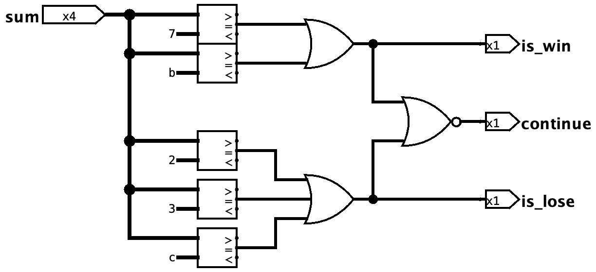
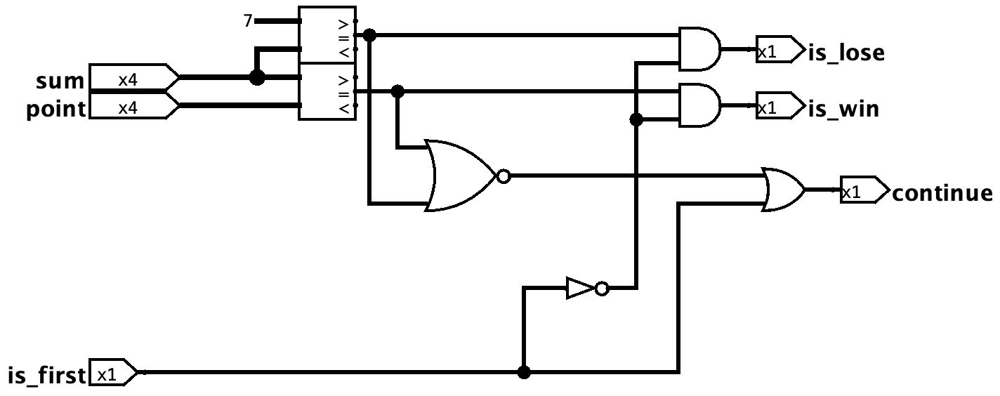
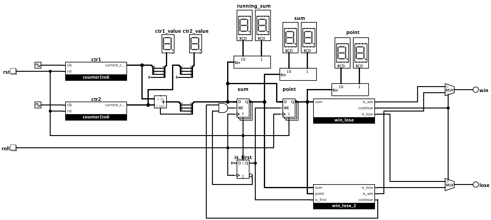

#### [<< Quay trở lại SPEC](./README.md)

#### [<< ALU](./ALU.md)

# 3. Xúc xắc

## 3.1 Phân tích và thiết kế

### 3.1.1. Khối counter 1-6

#### 3.1.1.1. Bảng chuyển trạng thái và ánh xạ sang flip-flop logic

Bảng chuyển trạng thái cần thiết lập:

|Trạng thái hiện tại|Trạng thái kế tiếp|
|:--:|:--:|
|S2 S1 S0|S2+ S1+ S0+|
|||
|001|010|
|010|011|
|011|100|
|100|101|
|101|110|
|110|001|
|||
|others|xxx|

Sử dụng D flip-flop với bảng trạng thái:

|CLK|Q+|
|:--:|:--:|
|rising edge|D|
|||
|others|Q|

Ta biến đổi được bảng logic phụ thuộc của các đầu vào D với trạng thái hiện tại:

|Trạng thái hiện tại|Đầu vào các D-FF|
|:--:|:--:|
|S2 S1 S0|D2 D1 D0|
|||
|001|010|
|010|011|
|011|100|
|100|101|
|101|110|
|110|001|
|||
|others|xxx|

#### 3.1.1.2. Tối ưu hoá biểu thức logic

Tiến hành lập các bảng k-map để tối ưu hoá biểu thức logic cho các đầu vào D-FF (D2, D1, D0):

##### a) Tối ưu cho D2:

Bảng k-map:

||_S2 S1_||||
|:-:|:-:|:-:|:-:|:-:|
|___S0___|_00_|_01_|_11_|_10_|
|_0_|x|0|0|1|
|_1_|0|1|x|1|

Nhóm được 2 nhóm maxterm sau:

||_S2 S1_||||
|:-:|:-:|:-:|:-:|:-:|
|___S0___|_00_|_01_|_11_|_10_|
|_0_|__x*__|0|0|1|
|_1_|__0*__|1|x|1|

=> S1' + S0

||_S2 S1_||||
|:-:|:-:|:-:|:-:|:-:|
|___S0___|_00_|_01_|_11_|_10_|
|_0_|x|__0*__|__0*__|1|
|_1_|0|1|x|1|

=> S2 + S1

Biểu thức tối ưu:

__=> D2 = (S1' + S0).(S2 + S1)__

###### b) Tối ưu cho D1:

Bảng k-map:

||_S2 S1_||||
|:-:|:-:|:-:|:-:|:-:|
|___S0___|_00_|_01_|_11_|_10_|
|_0_|x|1|0|0|
|_1_|1|0|x|1|

Nhóm được 2 nhóm minterm sau:

||_S2 S1_||||
|:-:|:-:|:-:|:-:|:-:|
|___S0___|_00_|_01_|_11_|_10_|
|_0_|__x*__|__1*__|0|0|
|_1_|1|0|x|1|

=> S2'S0'

||_S2 S1_||||
|:-:|:-:|:-:|:-:|:-:|
|___S0___|_00_|_01_|_11_|_10_|
|_0_|x|1|0|0|
|_1_|__1*__|0|x|__1*__|

=> S1'S0

Biểu thức tối ưu:

__=> D1 = S2'S0' + S1'S0 = (S2 + S0)' + S1'S0__

###### b) Tối ưu cho D0:

Bảng k-map:

||_S2 S1_||||
|:-:|:-:|:-:|:-:|:-:|
|___S0___|_00_|_01_|_11_|_10_|
|_0_|x|1|1|1|
|_1_|0|0|x|0|

Nhóm được nhóm minterm sau:

||_S2 S1_||||
|:-:|:-:|:-:|:-:|:-:|
|___S0___|_00_|_01_|_11_|_10_|
|_0_|__x*__|__1*__|__1*__|__1*__|
|_1_|0|0|x|0|

__=> D0 = S0'__

#### 3.1.1.3. Kết nối và hoàn thành thiết kế

Với các biểu thức logic như đã phân tích, ta thiết kế được một bộ đếm chuyển trạng thái từ 1-6:

Khi tín hiệu __rst__ được kích hoạt, trạng thái của mạch chuyển về S2S1S0 = 001, tương ứng với giá trị 1.

Mỗi chu kỳ tín hiệu __clk__ sẽ chuyển trạng thái đúng như yêu cầu.

### 3.1.2. Khối kiểm tra thắng/thua/tiếp

#### 3.1.2.1. Thắng/thua/tiếp trong lần đầu tiên đổ xúc xắc

Trong lần đầu đổ xúc xắc, kết quả thắng/thua/tiếp của mạch phụ thuộc vào giá trị của sum (tổng 2 bộ đếm counter):

|sum|trạng thái|sum|trạng thái|
|:--:|:--:|:--:|:--:|
|2|lose|7|win|
|3|lose|11|win|
|12|lose|||
|||||
|others|continue|||

#### 3.1.2.1. Thắng/thua/tiếp trong những lần tiếp theo đổ xúc xắc

Nếu lần đầu đổ xúc xắc không đem lại kết quả thắng hay thua, tiến hành kiểm tra giá trị sum được lưu lúc trước trong point với giá trị sum ở lần đổ hiện tại. Nếu so sánh hai giá trị bằng nhau => thắng, nếu không thì tiếp tục đổ. Trường hợp đổ phải số 2 => thua.

Nếu hiện tại đang là lần đổ đầu tiên (is_first = 1), mạch sẽ mặc định cho kết quả là tiếp tục (is_lose = 0, is_win = 0, continue = 1) mà không phụ thuộc vào sum và point.

|sum|trạng thái|sum|trạng thái|
|:--:|:--:|:--:|:--:|
|2|lose|point|win|
|||||
|others|continue|||

### 3.1.3. Kết nối các khối

Tiến hành kết nối các khối, tạo ra thiết kế module top của bộ xúc xắc này:

Có 2 bộ đếm được chạy liên tục với tần số khác nhau để tạo ra các giá trị giả ngẫu nhiên, kết nối tới một bộ cộng để tính giá trị __sum__.

Khi lần đầu đổ xúc xắc, giá trị __sum__ sẽ được chốt bởi thanh ghi __point__ và không thay đổi xuyên suốt quá trình trừ khi tín hiệu __rst__ được kích hoạt.

Với giá trị lần đầu tiên đổ xúc xắc được chốt bởi point, khối __win_lose__ sẽ kiểm tra điều kiện thắng/thua/tiếp. Nếu thắng hoặc thua ngay trong lần đầu, tín hiệu continue sẽ bị tắt, từ đó các bộ mux sẽ lựa chọn kết quả is_win, is_lose để làm kết quả win, lose cuối cùng. Nếu lần đầu chưa thắng hoặc thua, tín hiệu continue sẽ bật, các bộ mux sẽ lựa chọn kết quả is_win, is_lose của khối __win_lose_2__.

#### [<< Quay trở lại SPEC](./README.md)

#### [<< ALU](./ALU.md)
