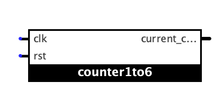
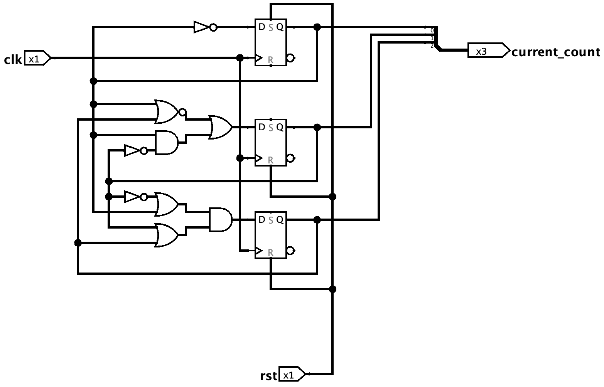

#### [<< Quay trở lại SPEC](./README.md)

#### [<< ALU](./ALU.md)

# 3. Xúc xắc

## 3.1 Phân tích và thiết kế

### 3.1.1. Khối counter 1-6

#### 3.1.1.1. Thiết kế bộ đếm

##### 3.1.1.1.1. Bảng chuyển trạng thái và ánh xạ sang flip-flop logic

Bảng chuyển trạng thái cần thiết lập:

|Trạng thái hiện tại|Trạng thái kế tiếp|
|:--:|:--:|
|S2 S1 S0|S2+ S1+ S0+|
|||
|001|010|
|010|011|
|011|100|
|100|101|
|101|110|
|110|001|
|||
|others|xxx|

Sử dụng D flip-flop với bảng trạng thái:

|CLK|Q+|
|:--:|:--:|
|rising edge|D|
|||
|others|Q|

Ta biến đổi được bảng logic phụ thuộc của các đầu vào D với trạng thái hiện tại:

|Trạng thái hiện tại|Đầu vào các D-FF|
|:--:|:--:|
|S2 S1 S0|D2 D1 D0|
|||
|001|010|
|010|011|
|011|100|
|100|101|
|101|110|
|110|001|
|||
|others|xxx|

##### 3.1.1.1.2. Tối ưu hoá biểu thức logic

Tiến hành lập các bảng k-map để tối ưu hoá biểu thức logic cho các đầu vào D-FF (D2, D1, D0):

###### a) Tối ưu cho D2:

Bảng k-map:

||_S2 S1_||||
|:-:|:-:|:-:|:-:|:-:|
|___S0___|_00_|_01_|_11_|_10_|
|_0_|x|0|0|1|
|_1_|0|1|x|1|

Nhóm được 2 nhóm maxterm sau:

||_S2 S1_||||
|:-:|:-:|:-:|:-:|:-:|
|___S0___|_00_|_01_|_11_|_10_|
|_0_|__x*__|0|0|1|
|_1_|__0*__|1|x|1|

=> S1' + S0

||_S2 S1_||||
|:-:|:-:|:-:|:-:|:-:|
|___S0___|_00_|_01_|_11_|_10_|
|_0_|x|__0*__|__0*__|1|
|_1_|0|1|x|1|

=> S2 + S1

Biểu thức tối ưu:

__=> D2 = (S1' + S0).(S2 + S1)__

###### b) Tối ưu cho D1:

Bảng k-map:

||_S2 S1_||||
|:-:|:-:|:-:|:-:|:-:|
|___S0___|_00_|_01_|_11_|_10_|
|_0_|x|1|0|0|
|_1_|1|0|x|1|

Nhóm được 2 nhóm minterm sau:

||_S2 S1_||||
|:-:|:-:|:-:|:-:|:-:|
|___S0___|_00_|_01_|_11_|_10_|
|_0_|__x*__|__1*__|0|0|
|_1_|1|0|x|1|

=> S2'S0'

||_S2 S1_||||
|:-:|:-:|:-:|:-:|:-:|
|___S0___|_00_|_01_|_11_|_10_|
|_0_|x|1|0|0|
|_1_|__1*__|0|x|__1*__|

=> S1'S0

Biểu thức tối ưu:

__=> D1 = S2'S0' + S1'S0 = (S2 + S0)' + S1'S0__

###### b) Tối ưu cho D0:

Bảng k-map:

||_S2 S1_||||
|:-:|:-:|:-:|:-:|:-:|
|___S0___|_00_|_01_|_11_|_10_|
|_0_|x|1|1|1|
|_1_|0|0|x|0|

Nhóm được nhóm minterm sau:

||_S2 S1_||||
|:-:|:-:|:-:|:-:|:-:|
|___S0___|_00_|_01_|_11_|_10_|
|_0_|__x*__|__1*__|__1*__|__1*__|
|_1_|0|0|x|0|

__=> D0 = S0'__

##### 3.1.1.1.3. Kết nối và hoàn thành thiết kế

Với các biểu thức logic như đã phân tích, ta thiết kế được một bộ đếm chuyển trạng thái từ 1-6:

Khi tín hiệu __rst__ được kích hoạt, trạng thái của mạch chuyển về S2S1S0 = 001, tương ứng với giá trị 1.

Mỗi chu kỳ tín hiệu __clk__ sẽ chuyển trạng thái đúng như yêu cầu.

#### [<< Quay trở lại SPEC](./README.md)

#### [<< ALU](./ALU.md)